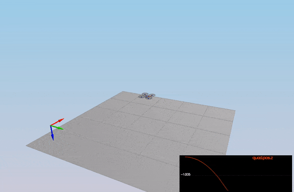
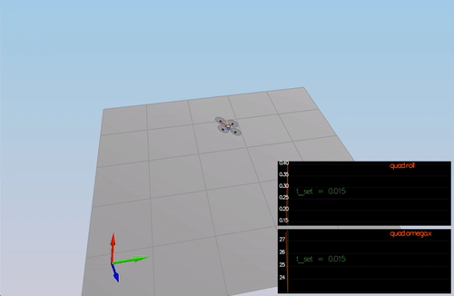
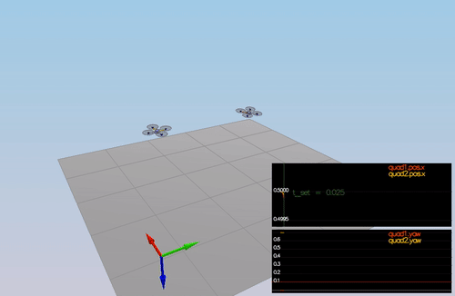
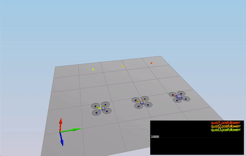
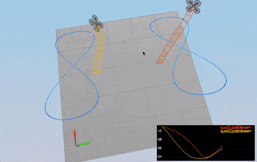

# Submission Readme #

This is the readme for my project submission. The original project README has be moved to PROJ_README for reference.

## The Tasks ##
Below I outline my 
* approach to the tasks
* a video / image demo 
* and finally the performance metrics.

## scenario 1: Intro (Hover) ##
Upon looking at the thrust as hinted in the outline one can see that the only parameter that can be changed is **mass** which is located in the _QuadControls.txt_. 

```
Mass = 0.49
```

```C++
cmd.desiredThrustsN[0] = mass * 9.81f / 4.f; // front left
cmd.desiredThrustsN[1] = mass * 9.81f / 4.f; // front right
cmd.desiredThrustsN[2] = mass * 9.81f / 4.f; // rear left
cmd.desiredThrustsN[3] = mass * 9.81f / 4.f; // rear right
```

<p align="center">

</p>

**Evaluation:**
```
PASS: ABS(Quad.PosFollowErr) was less than 0.500000 for at least 0.800000 seconds
Simulation #4 (../config/1_Intro.txt)
```

## scenario 2: Body rate and roll/pitch control ##
**1. Implement`GenerateMotorCommands()`**

This was pretty tricky for me as it was different to the what we implemented in the coursework. However taking a logical approach to this problem was key. It came down to solving the force matrix (below) by first calculating the Roll, Pitch and Yaw commands from the moments.
 
 
 _Collective Thrust: F1 + F2 + F3 + F4 = Tf<br>
  Roll Command:      F1 - F2 - F3 + F4 = Tx/l<br>
 Pitch Command:     F1 + F2 - F3 - F4 = Ty/l<br>
 Yaw Command:       F1 - F2 + F3 - F4 = Tz/kappa_<br>
 
 
 It was important to pay attention to the rotor positions. The above is base on the following:
 <p align="center">
   
 </p>
 
 Finally the *CONSTRAIN* command was utilised to keep motor thrust within the configuration limits.
 
 ```C++
    cmd.desiredThrustsN[0] = CONSTRAIN(0.25f * (collThrustCmd + fx + fy + fz), minMotorThrust, maxMotorThrust); // front left
    cmd.desiredThrustsN[1] = CONSTRAIN(0.25f * (collThrustCmd - fx + fy - fz), minMotorThrust, maxMotorThrust); // front right
    cmd.desiredThrustsN[2] = CONSTRAIN(0.25f * (collThrustCmd + fx - fy - fz), minMotorThrust, maxMotorThrust); // rear left
    cmd.desiredThrustsN[3] = CONSTRAIN(0.25f * (collThrustCmd - fx - fy + fz), minMotorThrust, maxMotorThrust); // rear right
    
 ```
 
 
 
 **2. Implement `BodyRateControl()`** 
 
 This was pretty straight forward based on the course work. Creating the moments based on the error and applying the moments of intertia.
 
 ```
 V3F rate_error = (pqrCmd - pqr) * kpPQR;
 momentCmd.x = rate_error.x * Ixx;
 momentCmd.y = rate_error.y * Iyy;
 momentCmd.z = rate_error.z * Izz;
 ```
 
Next it was the initial tuning of `kpPQR` in `QuadControlParams.txt` to get the vehicle to stop spinning quickly but not overshoot. This turned out to be only the begining of tuning these parameters :)
 
 **3. Implement `RollPitchControl()`**
 
 This one was a bit tricky with the _collThrustCmd_ being in N. In the course work it was implemented differently but applying the equation *F=ma* it was easy enough to convert and once that was solved the rest was pretty inline with the equations for calculation the pqr commands using the rotation matrix.
 
 ```C++
 if (collThrustCmd > 0.0) {
        float c_d = collThrustCmd / mass;
        
        float target_R13 = -CONSTRAIN(accelCmd.x / c_d, -maxTiltAngle, maxTiltAngle);
        float target_R23 = -CONSTRAIN(accelCmd.y / c_d, -maxTiltAngle, maxTiltAngle);
        
        pqrCmd.x = (1/R(2, 2)) * (R(1, 0) * ( kpBank * (target_R13 - R(0, 2)) ) - R(0, 0) * ( kpBank * (target_R23 - R(1, 2)) ) );
        
        pqrCmd.y = (1/R(2, 2)) * (R(1, 1) * ( kpBank * (target_R13 - R(0, 2)) ) - R(0, 1) * ( kpBank * (target_R23 - R(1, 2)) ) );
        
        pqrCmd.z = 0.0f;
    }
    else {
        // Otherwise command no rate
        pqrCmd.x = 0.0;
        pqrCmd.y = 0.0;
    }
 ```
 
 After a bit of tuning of `kpPQR` and `kpBank` stable flight was achieved! 
 
 <p align="center">

</p>
 
**Evaluation:**
   - roll should less than 0.025 radian of nominal for 0.75 seconds (3/4 of the duration of the loop)
   - roll rate should less than 2.5 radian/sec for 0.75 seconds
```
Simulation #30 (../config/2_AttitudeControl.txt)
PASS: ABS(Quad.Roll) was less than 0.025000 for at least 0.750000 seconds
PASS: ABS(Quad.Omega.X) was less than 2.500000 for at least 0.750000 seconds
```


 ## scenario 3: Position/velocity and yaw angle control ##
 
 **1. Implement `LateralPositionControl()`**
 The tricky part of implementing LateralPositionControl was figuring out which values to clamp. I chose to clamp the _commaded velocity_ and the _feed forward acceleration_ values but I look forward from the examiner as to whether this is correct. Note: `accelCmd` is always initialized with the _feed forward_ value hence clamping `accelCmd`.
 
 ```C++
    V3F p_term;
    V3F d_term;
    
    p_term = kpPosXY * (posCmd - pos);
    
    if (velCmd.magXY() > maxSpeedXY) {
        velCmd = velCmd * maxSpeedXY / velCmd.magXY();
    }
    
    d_term - kpVelXY * (velCmd - vel);
        
    if (accelCmd.magXY() > maxAccelXY){
        accelCmd = accelCmd * maxAccelXY / accelCmd.magXY();
    }
    
    accelCmd = kpPosXY * (posCmd - pos) + kpVelXY * (velCmd - vel) + accelCmd;
 ```
 
 **2. Implement `AltitudeControl()`**
 Altitude Control was implemented as a PD controller with clamping on the velocity. Later on for scenario 4 this was converted to a PID controller by implementing basic integral control.
 
 ```C++
    float z_vel =  CONSTRAIN(kpPosZ * (posZCmd - posZ ) + velZCmd, -maxDescentRate, maxAscentRate);
    integratedAltitudeError += (posZCmd - posZ) * dt;
    float u_bar = kpVelZ * (z_vel - velZ) + (KiPosZ * integratedAltitudeError) + accelZCmd;
    
    thrust = -(mass * (u_bar - CONST_GRAVITY) / R(2,2));
 ```
 
 **3. Implement `YawControl()`**
 Implemented a P controller for yaw command and added optimization for clockwise vs counter-clockwise rotation.
 
 ```C++
    yawCmd = fmodf(yawCmd, 2.f * M_PI);
    float yaw_err = yawCmd - yaw;
    
    if (yaw_err > M_PI){
        yaw_err -= 2.f * M_PI;
    } else if (yaw_err < -M_PI) {
        yaw_err += 2.f * M_PI;
    }
    
    yawRateCmd = kpYaw * yaw_err;
 ```
 After tuning the `kpYaw` and the (z) component of `kpPQR` we have success!
 
 <p align="center">

</p>
 
 
 **Evaluation:**
   - X position of both drones should be within 0.1 meters of the target for at least 1.25 seconds
   - Quad2 yaw should be within 0.1 of the target for at least 1 second
   
 ```
Simulation #56 (../config/3_PositionControl.txt)
PASS: ABS(Quad1.Pos.X) was less than 0.100000 for at least 1.250000 seconds
PASS: ABS(Quad2.Pos.X) was less than 0.100000 for at least 1.250000 seconds
PASS: ABS(Quad2.Yaw) was less than 0.100000 for at least 1.000000 seconds
```


 ## scenario 4: Non-idealities and robustness ##
 
 **1. Add basic integral control to `AltitudeControl()`** 
 Added integral control by keeping the accumulated velocity error.
 
  ```C++
    integratedAltitudeError += (posZCmd - posZ) * dt;
    float u_bar = kpVelZ * (z_vel - velZ) + (KiPosZ * integratedAltitudeError) + accelZCmd;
 ```
 
 After tuning `KiPosZ` and adjusting almost all the other variables we have a decent flight.
 
 <p align="center">

</p>
 
 **Evaluation:**
   - position error for all 3 quads should be less than 0.1 meters for at least 1.5 seconds
```
Simulation #78 (../config/4_Nonidealities.txt)
PASS: ABS(Quad1.PosFollowErr) was less than 0.100000 for at least 1.500000 seconds
PASS: ABS(Quad2.PosFollowErr) was less than 0.100000 for at least 1.500000 seconds
PASS: ABS(Quad3.PosFollowErr) was less than 0.100000 for at least 1.500000 seconds
```


 ## scenario 5: Tracking trajectories ##
 
 Here for **challenge 1** I add the velocity information per time step by doing the following:
 
 ```Python
 if (t > 0):	
			vx = (x - px) / timestep
			vy = (y - py) / timestep
			vz = (z - pz) / timestep
 px, py, pz = x, y, z
 the_file.write("," + fmt(vx) + "," + fmt(vy) + "," + fmt(vz))
 ```
 I then tried my hand at challenge 2 by adding roll pitch and yaw values followed by the roll pitch and yaw rates. I modified the path for the orange drone to compare the two. It was interesting to see that the orange droned out performed, matched and under performed against the yellow drone depending on how the parameters were tuned in `QuadControlParams`. I think I will spend a bit more time on this post submission.
 
 ```Python
  yaw, pitch, roll = 0.0, 0.0, 0.0
		p, q, r =  0.0, 0.0, 0.0	
		
		if (t > 0):	
			vx = (x - px) / timestep
			vy = (y - py) / timestep
			vz = (z - pz) / timestep
		
			if (t < maxtime):

				fx = math.sin((t + timestep) * 2 * math.pi / period[0] + phase[0]) * radius * amp[0] + center[0]
				fy = math.sin((t + timestep) * 2 * math.pi / period[1] + phase[1]) * radius * amp[1] + center[1]
				fz = math.sin((t + timestep) * 2 * math.pi / period[2] + phase[2]) * radius * amp[2] + center[2]

				p1 = np.array([px,py,pz])
				p2 = np.array([x,y,z])
				p3 = np.array([fx,fy,fz])

				v1 = np.subtract(p2,p1)
				v2 = np.subtract(p3,p2)

				R = rotation_matrix_from_vectors(v1,v2)
				sy = math.sqrt(R[0,0] * R[0,0] +  R[1,0] * R[1,0])

				roll = math.atan2(R[2,1] , R[2,2])
				pitch = math.atan2(-R[2,0], sy)
				yaw = math.atan2(R[1,0], R[0,0])

				p = roll / timestep
				q = pitch / timestep
				r = roll / timestep

		px, py, pz = x, y, z

		######## END STUDENT CODE
		the_file.write("," + fmt(vx) + "," + fmt(vy) + "," + fmt(vz))
		the_file.write("," + fmt(yaw) + "," + fmt(pitch) + "," + fmt(roll))
		the_file.write("," + fmt(p) + "," + fmt(q) + "," + fmt(r))
  ```
 
 After some tuning and going back to the other scenarios for further tuning we have successful flights in all 5 scenarios!
 
 <p align="center">

</p>
 
 **Evaluation:**
   - position error of the quad should be less than 0.25 meters for at least 3 seconds
```
Simulation #90 (../config/5_TrajectoryFollow.txt)
PASS: ABS(Quad2.PosFollowErr) was less than 0.250000 for at least 3.000000 seconds
```


